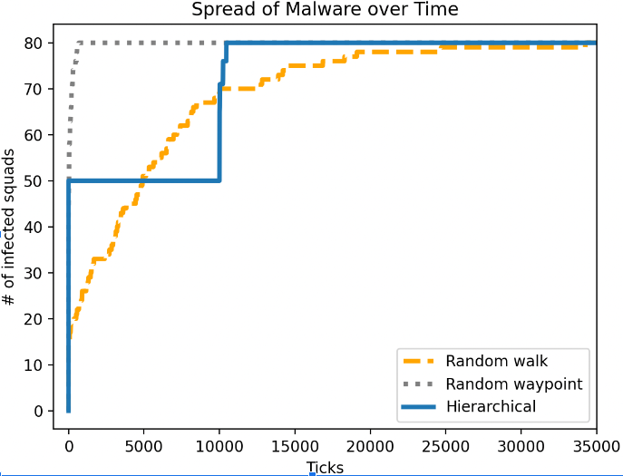

# Malware Spread in Mobile Networks - Final Report

## By: Berwin, Trinity, Miles

### Abstract

The paper we decided to choose investigates how malware spreads in mobile tactical networks using an agent-based model. The paper simulates agents within a military network of Platoons that are composed of Squads that move around and interact with other groups. The probability of interaction between different squads are guided by three different movement patterns: random walk, random waypoint, and hierarchical. Based on each agent’s movements, it impacts their probability of getting infected by malware. The paper compares the rate of malware spread between these three movement patterns of agents and does a parameter sweep for different malware defense percentages and how fast malware spreads between these 3 different movement patterns with different levels of defense against malware. In their results, they identify that malware took the longest to spread in the random walk movement pattern, while malware spread the quickest in the random waypoint movement pattern. Furthermore, they conduct a parameter sweep on how different levels of fortification against malware impacts the spread of malware, which shows that unless defenses are around 80% there is only a slight slowing of malware spread. Overall, the paper identifies different movement configurations and fortification levels to understand at what percentage and what movement resistance to malware is acceptable. In our replication, we were able to replicate the spread rates of 2 out of 3 of the movement patterns.

### Introduction

Cybersecurity is a growing concern in the online society we live in today. It is increasingly easy for malware to be installed on devices. We used [An agent-based modeling framework for cybersecurity in mobile tactical networks](https://journals.sagepub.com/doi/10.1177/1548512917738858) by Brian Thompson and James Morris-King as a basis for replication.

This paper investigates how malware infiltrates mobile tactical networks given different movement patterns and types of security fortifications against mobile networks through agent based modeling. The paper highlights how even if different mobile networks may be isolated from others, lack of effective security policies coupled with different types of movement interactions can heavily impact malware spread behavior in the overall system.

### Methodology

First off, to simulate the behavior of mobile tactical networks, as part of the paper's design, each agent represents a squad, and squads are group together to form platoons, which makes agents cluster together when moving around. All agents active on the field are part of a company. 

Then, agents are simulated to move around on the map initially starting out as uninfected.There are certain parts of the map however that can infect squads, and infected squad contact can lead to other squads to become infected as well. 

The three types of movement the paper investigated are the following:

- Random walk: Squads randomly spawn and each squad takes a step in a random direction.
- Random waypoint: Squads randomly spawn, choose a random point, and perform a walk toward that point until the squad has arrived. Squads are also independent here.
- Hierarchical: Squads begin at their company’s outpost, which is a randomly selected but constant point. They stay there for a little bit, then go to a random waypoint as a company. Then, the Squads random walk independently, then the cycle repeats.

 We are replicating the experiment that compares the rate of malware spread across three different movement patterns. It is important to note that for each walk while squads randomly move in any direction, it is written so that squads generally are clustered by platoon.

**Figure 1:** Animation of random walk over time, focusing on a small window. Blue agents represent uninfected devices and red represent infected.

<!--  -->

### Replication Results

In our replication, we tested out the random walk and random waypoint movements. We successfully replicated the general shapes of each curve, and we see that like the original experiment, the malware spreads extremely quickly with the random waypoint and much slower with the random walk. Our results of the replication are below:

<!--  -->

**Figure 2a:** Spread of malware over time results from the paper by Brian Thompson and James Morris-King. Each hour corresponds to 1000 ticks. 

**Figure 2b:**
 Spread of malware over time, where each 1000 ticks corresponds to one hour. Similar to the paper, each travel method eventually hits the carrying capacity of 15 squads, which is the number of squads initialized.

Based on our results, we found that the random waypoint movement causes malware to spread more rapidly than the random walk movement. Although agents’ maximum step size is the same in all of the movement patterns, the agents end up interacting more with each other when they are moving to random waypoints. We also attempted to do hierarchial and the results we got were a lot less accurate to the paper compared to random walk and waypoint, but it was accurate in that it was the second fastest spreading movement type. 

### Extension Results

While we were able to sweep fewer platoons than random walk, there is less of a clear trend for random waypoint. As the number of platoons increases, the rate of infection doesn't necessarily increase with it. We think this is because random waypoint is less heavily influenced by how close agents spawn to one another, unlike random walk.

The main parameter sweep we did was on random walk, where we increased the size of the squads and platoons to see how that would affect the spread. 

**Figure 3** shows a parameter sweep with increasing number of platoons but stable number of squads being at 4 per platoon. The number of infected squads has been normalized to percentages so that all sweeps can be plotted on the same graph even with increasing total number of agents. The red dot on each sweep line signifies when the over 50% of squads have been infected. 

We also did a quick parameter sweep with random waypoint but with increasing number of squads per platoon instead, but only up to 30 platoons as the computational time for random waypoint was significantly longer than random walk. 

**Figure 4** Shows a parameter sweep with increasing number of platoons but stable number of squads, being 4 squads per platoon. The red dot signifies for each swep when over 50% of the squads have been infected. 

Overall it seems like increasing the number of platoons does not drastically change the behavior of infection, and rather slows or speeds at the rate that malware spreads. 

Finally, one last parameter sweep we did was to see whether defenses or higher resistance of infection would impact the malware spread rate.

At 80 squads and for 1000 timesteps, we ran a parameter sweep with changing defenses/malware defenses. We changed how high the malware immunity was, so that when a agent was in contact with an infected agent, we could control the probability that they would be getting infected. For example, if they were at 90% defenses, it would mean that agents in contact with malware had a 90% chance of not becoming infected. The results are below.

**Figure 5** Shows how defenses against malware impact speed of malware spread. Any defenses 70% or above shows a notable slow in initial infection across the networks, but any defenses below 70% are indistinguishable with the rest of the parameter sweep. 

Overall, we can see that defenses only are effectively if they have high coverage. However, in general, 10% is the worst in terms of slowly malware spread which means that any coverage is probably better than none. 

### Discussion

One continuing cause for concern is adapting the paper from Repast Simphony to repast4py, the Python library. As a result, we’ve done a lot of tuning, such as the times agents move on each step and the size of the infection area. However, the switch to Python means that we haven't been able to perfectly replicate the experiments; for example, the shapes of the infection curves are fairly accurate, but the time steps aren't perfectly replicated (our model takes much longer to produce the same behavior).

The original paper explored how different movement behaviors would impact spread, and we have found that certain movement styles impact the speed of malware spread in a system. 

It's also unfortunate that our implementation for all random waypoint and hierarchial are not as robust and thus we couldn't do as much parameter sweeping as we wished.

### Conclusion
Based on our modeling results, we can conclude that movement patterns that cause agents to travel further across the space lead to higher rates of infection. Especially with lower agent density after random spawning, a random-walk-like strategy can cause them to stay in their own area and not interact with other agents. This impacts any organization that has a large number of agents traversing an area, and they can use this model to make informed decisions about how to avoid malware attacks.

When looking at the at results from out initial replication, it is clear that there is a lot of tweaking and tuning that is required for us if we wanted to exactly replicate the results of the paper. The paper did not give any specific dimensions or parameter values, so we had to guess the size of the map as well as the number of platoons. This probably affected the results as we had an insanely large map initially (886x886) which led to infection rates being much slower than anticipated. After shrinking the map to 500x500 for the parameter sweeps it was clear that the timesteps needed to show full infection was a lot shorter than what we first started with. However, we were able to replicate the general behavior of each movement which tells us that our foundational logic is solid. The parameter sweep also reinforced 

Another factor that impacted or replication results and continuing cause for concern is adapting the paper from Repast Simphony to repast4py, the Python library. As a result, we’ve done a lot of tuning, such as the times agents move on each step and the size of the infection area.

### Annotated Bibliography

[1] [An agent-based modeling framework for cybersecurity in mobile tactical networks](https://journals.sagepub.com/doi/10.1177/1548512917738858) **Brian Thompson, James Morris-King**
This paper investigates how malware infiltrates mobile tactical networks given different movement patterns and types of security forifications against mobile networks through agent based modelling. The paper highlights how even if different mobile networks may be isolated from others, lack of effective security policies coupled with different types of movement interactions can heavily impact malware spread behavior in the overall system.
