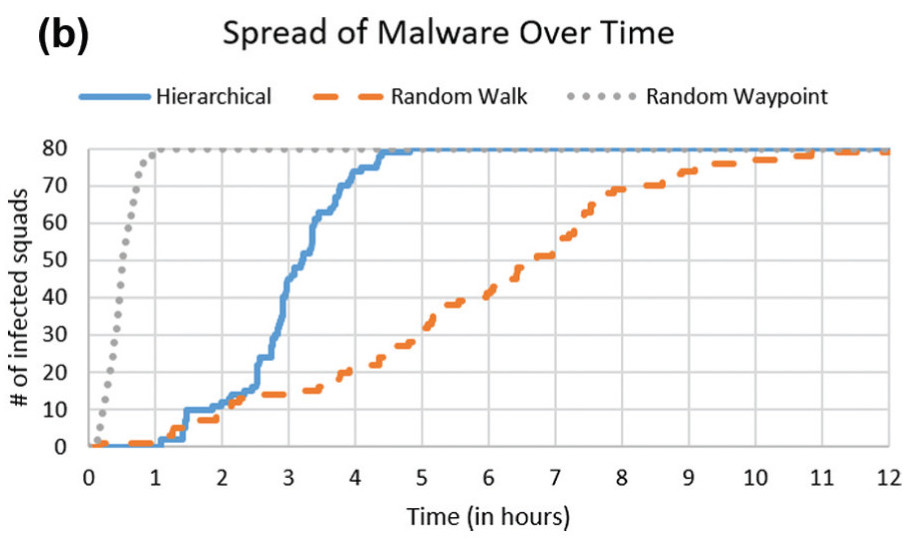

# Malware Spread in Mobile Networks - Final Report

## By: Berwin, Trinity, Miles

### Abstract

The paper we decided to choose investigates how malware spreads in mobile tactical networks using an agent-based model. The paper simulates agents within a military network of Platoons that are composed of Squads that move around and interact with other groups. The probability of interaction between different squads are guided by three different movement patterns: random walk, random waypoint, and hierarchical. Based on each agent’s movements, it impacts their probability of getting infected by malware. The paper compares the rate of malware spread between these three movement patterns of agents and does a parameter sweep for different malware defense percentages and how fast malware spreads between these 3 different movement patterns with different levels of defense against malware. In their results, they identify that malware took the longest to spread in the random walk movement pattern, while malware spread the quickest in the random waypoint movement pattern. Furthermore, they conduct a parameter sweep on how different levels of fortification against malware impacts the spread of malware, which shows that unless defenses are around 80% there is only a slight slowing of malware spread. Overall, the paper identifies different movement configurations and fortification levels to understand at what percentage and what movement resistance to malware is acceptable. In our replication, we were able to replicate the spread rates of 2 out of 3 of the movement patterns.

### Introduction

Cybersecurity is a growing concern in the online society we live in today. It is increasingly easy for malware to be installed on devices. We used [An agent-based modeling framework for cybersecurity in mobile tactical networks](https://journals.sagepub.com/doi/10.1177/1548512917738858) by Brian Thompson and James Morris-King as a basis for replication.

This paper investigates how malware infiltrates mobile tactical networks given different movement patterns and types of security fortifications against mobile networks through agent based modeling. The paper highlights how even if different mobile networks may be isolated from others, lack of effective security policies coupled with different types of movement interactions can heavily impact malware spread behavior in the overall system.

### Methodology

The three types of movement the paper investigated are the following:

- Random walk: Squads randomly spawn and each squad takes a step in a random direction.
- Random waypoint: Squads randomly spawn, choose a random point, and perform a walk toward that point until the squad has arrived. Squads are also independent here.
- Hierarchical: Squads begin at their company’s outpost, which is a randomly selected but constant point. They stay there for a little bit, then go to a random waypoint as a company. Then, the Squads random walk independently, then the cycle repeats.

We are replicating the experiment that compares the rate of malware spread across three different movement patterns.

**Figure 1:** Animation of random walk over time, focusing on a small window. Blue agents represent uninfected devices and red represent infected.

<!--  -->

### Replication Results

In our replication, we tested out the random walk and random waypoint movements. We successfully replicated the general shapes of each curve, and we see that like the original experiment, the malware spreads extremely quickly with the random waypoint and much slower with the random walk. Our results of the replication are below:

**Figure 2:** Spread of malware over time, where each 300 ticks corresponds to one hour. Similar to the paper, each travel method eventually infects every squad.

Based on our results, we found that the random waypoint movement causes malware to spread more rapidly than the random walk movement. Although agents’ maximum step size is the same in all of the movement patterns, the agents end up interacting more with each other when they are moving to random waypoints.

### Extension Results

For our extension we plan to do a parameter sweep on different values for platoons and squads for different types of movement. Currently we have the infrastructure built for a parameter sweep, and we just need to log all the data and visualize it. The paper never delved into the impacts of different sizes for platoons and squads on malware spread, meaning that this extension will give us a clear idea how size impacts mobile network infection rate.

**Figure 3:** Parameter sweep of 10, 20, and 30 platoons 

### Discussion

One continuing cause for concern is adapting the paper from Repast Simphony to repast4py, the Python library. As a result, we’ve done a lot of tuning, such as the times agents move on each step and the size of the infection area. However, the switch to Python means that we haven't been able to perfectly replicate the experiments; for example, the shapes of the infection curves are fairly accurate, but the time steps aren't perfectly replicated (our model takes much longer to produce the same behavior).

### Conclusion

### Annotated Bibliography

[1] [An agent-based modeling framework for cybersecurity in mobile tactical networks](https://journals.sagepub.com/doi/10.1177/1548512917738858) **Brian Thompson, James Morris-King**
This paper investigates how malware infiltrates mobile tactical networks given different movement patterns and types of security forifications against mobile networks through agent based modelling. The paper highlights how even if different mobile networks may be isolated from others, lack of effective security policies coupled with different types of movement interactions can heavily impact malware spread behavior in the overall system.
