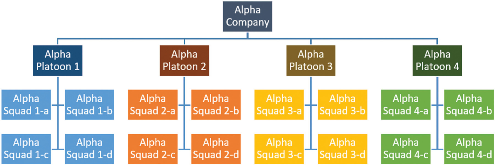
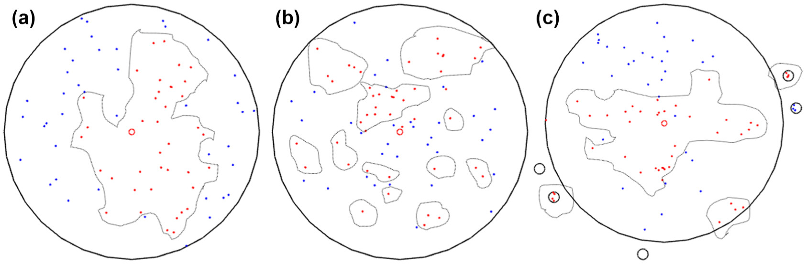
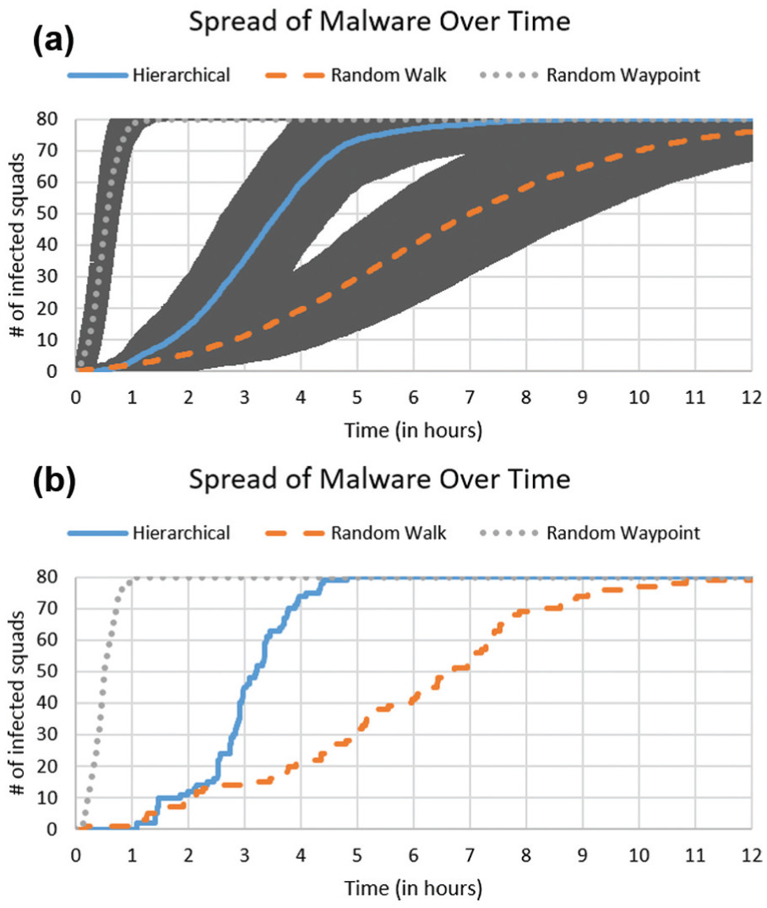
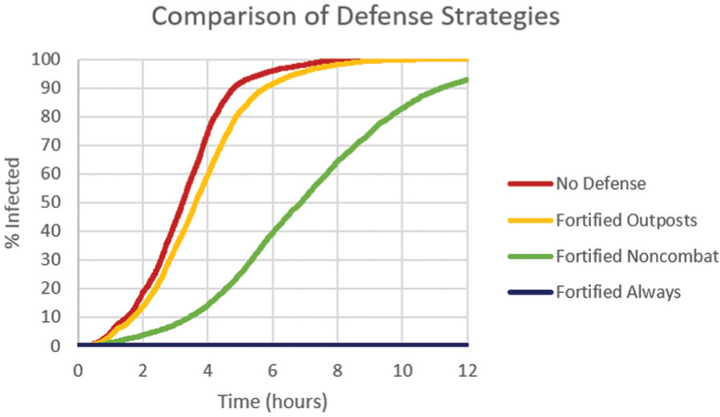

# Agent-Based Modeling of Malware in Mobile Tactical Networks (MTN)
### By: Berwin Lan, Miles Mezaki, Trinity Lee

## Abstract
The paper we decided to choose investigates how malware spreads in mobile tactical networks using an agent-based model. The paper simulates agents within a military network of `Platoon`s that are composed of `Squad`s that move around and interact with other groups. The probability of interaction between different squads are guided by three different movement patterns: random walk, random waypoint, and hierarchical. Based on each agent’s movements, it impact their probability of getting infected by malware. The paper compares the rate of malware spread between these three movement patterns of agents and does a parameter sweep for different malware defense percentages and how fast malware spreads between these 3 different movement patterns with different levels of defense against malware. In their results, they identify that malware took the longest to spread in the random walk movement pattern, while malware spread the quickest in the random waypoint movement pattern. Furthermore, they conducted a parameter sweep on how different levels of fortification against malware impacts the spread of malware, which showed that unless defenses were around 80% there was only a slight slowing of malware spread. 

We plan on replicating [An agent-based modeling framework for cybersecurity in mobile tactical networks](https://journals.sagepub.com/doi/10.1177/1548512917738858). Mobile tactical networks allow communication down the chain of command in a military setting, although the same concept holds for organizations like companies, summer camps, large teams, etc. working together to achieve a common goal. The authors use agent-based modeling to study how malware spreads in these networks. They compare three dynamics of spread: random walk, random waypoint, and hierarchical, and they find that random waypoint spreads the fastest. They also compare four defense policies and sweep the percentage of compliance, considering efficacy against cost. We were interested in this replication because of its relevance to cybersecurity, our interest in agent-based models, and its extensibility to non-military applications.

## Background
The agents in the model are organized into units:

Agents move as a squad, and any infected device in a squad instantaneously spreads to the full squad. As shown, squads can also be grouped into a `Platoon` or `Company`.

We plan on replicating a scenario of excursions into a circular town of radius 500m. There are 80 squads, each moving at a maximum speed of 1m/s. Mobile devices have a range of 9m and start uninfected. They run the simulations for 3600 time steps (representing 12 hours) and take averages over 100 independent trials.

They run 3 different mobility models:
* Random walk, where the squads don’t travel far from their origin
* Random waypoint, where squads often travel the length of their environment to random waypoints
* Hierarchical, where multiple squads start at their `Company`’s location. They then split up by `Platoon` and head to a new waypoint, then do a random walk as squads. The cycle repeats.

## Our project
Although their model is spatial, we plan on simplifying it to what we have learned in class. We think we will go about this by placing the agents on a coordinate system and implementing the mobility models by changing the coordinates of agents. From there, we can find the distance between agents to simulate two mobile devices’ interacting within range.

For a reach, we could conduct their parameter sweep on malware spread given different levels of defenses against malware. This would just build upon the model and just change how easily an agent could get infected. For our extension, we could conduct this parameter sweep on all three different movement types, which the paper does not do. 

The first result we want to replicate is the rate of malware spread depending on the mobility model, shown below. We don’t expect that we’ll be able to replicate this exactly because of how we’re using a different underlying model, but the characteristics we’ll be looking for are (a) differentiation in the three methods’ rates of spread and (b) roughly the same shaped logistic curves.

If we have more time, we also want to implement at least one of the defense policies described in the paper. The following classes of policies are described in the paper as follows:
* Fortified outposts: Policies are implemented to prevent malware from spreading to or from devices carried by units at an outpost (e.g. requiring soldiers to disable Bluetooth before entering an outpost).
* Fortified noncombat: Policies are implemented to prevent malware from spreading to or from devices carried by units that are not currently in combat (i.e. at an outpost or in transit).
* Fortified always: Policies are implemented to prevent malware from spreading to or from devices carried by units at all times.
We will know if our replication has been successful if more fortified policies lead to slower spread of malware.

## Causes for concern
One cause for concern is the way we’re adapting a spatial model to be on a coordinate grid or other kind of network. Although we think we can get very similar results, we may be missing an essential component that we only get with a spatial simulation. Another cause of concern is that we will need to modify our models significantly from the original paper as their implementation is military-specific, which we as a team would prefer to deviate from. While there are plenty of different scenarios that emulate the mobile tactical network formation and behavior, it is still a significant difference between the original paper and our implementation. Aside from that, it seems like we just need to implement and test malware spread against 3 different movement patterns and then potentially do a parameter sweep as a reach.

## Timeline
Below are the tasks we need to complete to succeed in this project.
* Everyone: read the paper by 4/9, start dividing work
* Develop agent class
* Develop class to keep track of agents in a network
* Develop spatial movement in a network via a class/function
* Write different movement patterns
* Write a function to emulate malware spread
* Write functions for visualizations/graphs/parameter sweeps
* Replication is due 4/16
* Begin Writeup
* Finish visualizations & graphs
* Finish Writeup